# _**Watson Assistant 101**_: Lab 5 - Enhancing Your Chatbot (II)
In this final lab we'll personalise our chatbot by requesting the user's name at the start of a conversation, and reuse it when appropriate. We'll use _context variables_ for this, and also show you how to use _expressions_ to do some more advanced data manipulation.

## Requirements
- Successful completion of [Lab 4: Enhancing Your Chatbot (I)](../4-Advanced)

## Agenda
- manipulating values with _**Expressions**_
- adding more intelligence to your responses
- using _Spring Expression Language (SpEL)_

## Using Expressions
_**Watson Assistant**_ allows you to process values extracted from user input that you might want to reference in a _context variable_, condition, or elsewhere in your response.

You can write _**expressions**_ that access objects and properties of objects by using the **Spring Expression (SpEL) language**. We'll show how you can use this in your _**Watson Assistant**_ _skills_ via a couple of simple examples that will enhance our welcome message to the user.

**(1)** First, we'll personalise some of our responses by asking for the user's name when we greet them, saving it in a _context variable_, and reusing it when we ask them if they need any more help.

Change the `Welcome` node response to `Hello I'm Mobi, a mobile phone advisor! What's your name?`

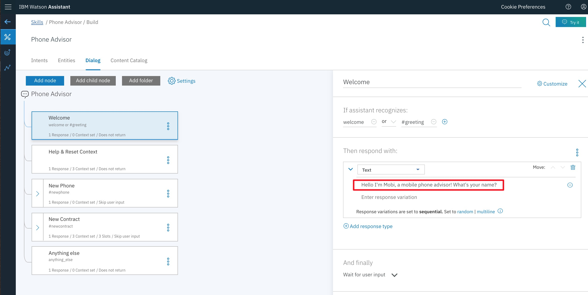

**(2)** _**Watson Assistant**_ can pick up names using a system entity called **@sys-person**. Go and turn this `On` now:

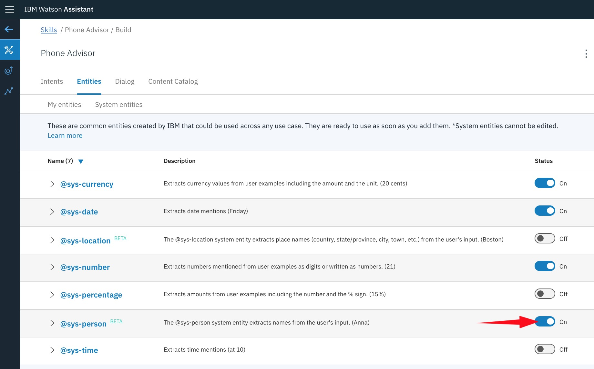

**(3)** Add a child node to `Welcome` and call it `Get Name`. Configure it to use a _slot_ to check for `@sys-person`, save it as a context variable called `$name`.

If a name isn't picked up, ask the user to try again by responding with `Sorry I don't recognise that as a name. Please try again!`. If we do find a name, respond with `Hi $name, how can I help you?`

Your `Get Name` node should look something like this:

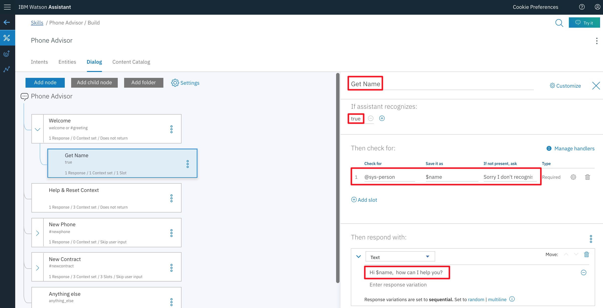

If you `Try It`, you should see it picking up and reusing a name successfully:

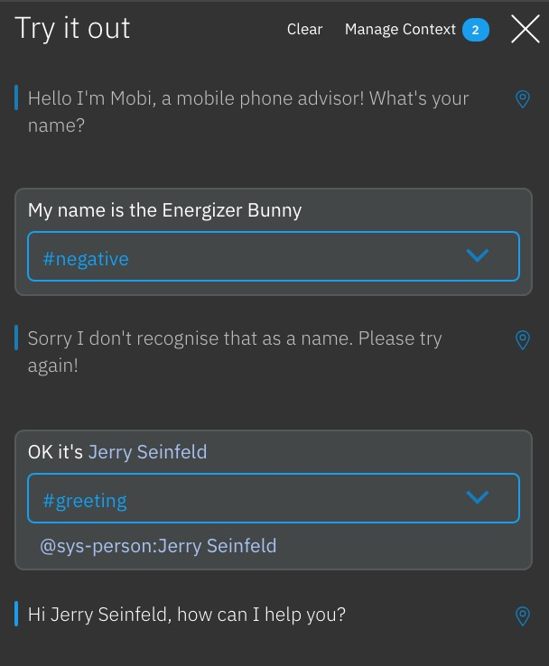

**(4)** Calling somebody by their full name is a little formal, so we're going to use an _expression_ to extract the user's first name, and use this in our responses.

Open the `Context editor` in the `Get Name` node, and add a variable called `$foreName`. In the value field, use the following _expression_:
```javascript
"<? $name.extract('^[^\\s]+',0) ?>"
```
This expression takes the variable `$name`, and uses the _SpEL_ **extract** function to return just the `$foreName`. The pattern within the function returns everything from the start of the string until it reaches the first whitespace character (e.g. a space).

If you want to know more about how this works, you can click [here](https://docs.spring.io/spring/docs/current/spring-framework-reference/core.html#expressions) for more information on _SpEL_. [This site](https://regexr.com/) is also really useful in helping to interactively build and test expressions.

Also, change **And respond with** to: `Hi $foreName,  how can I help you?`

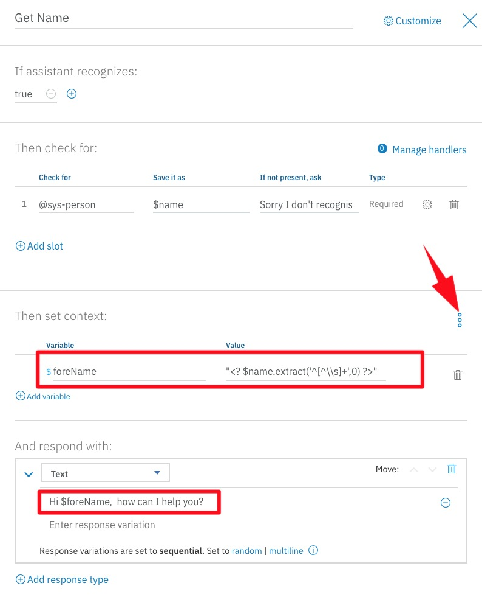

Your _dialog_ should now shorten the user's name to their forename:

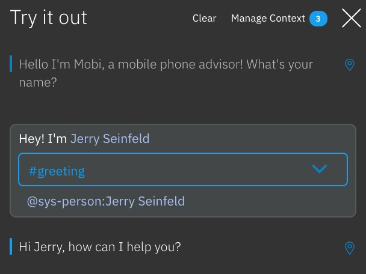

**(5)** Next, let's change our `Help & Reset Context` node and personalise this response by reusing the user's forename.

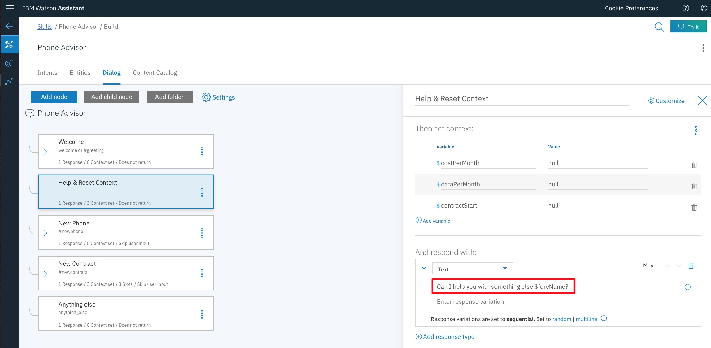

Note that we **do not reinitialise** the `$foreName` _context variable_ (as we have done with other _slot_-based variables so far), as we want to continually **reuse** it once it's been captured.

**(6)** Here's how a full interaction should work in your web widget now:

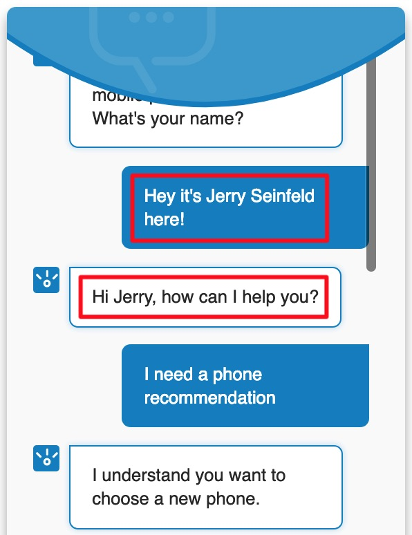
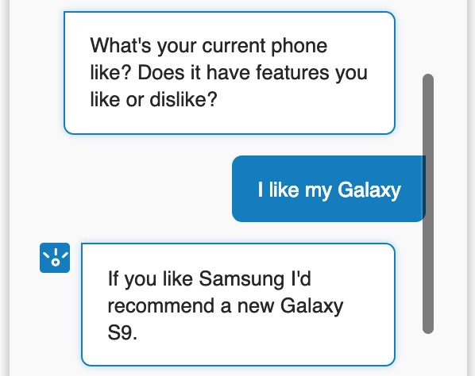
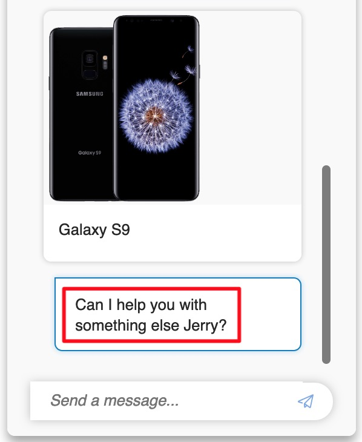

**(7)** We can also work with date and time in _expressions_.

For example:

`now()`: returns a string with the current date and time in the format yyyy-MM-dd HH:mm:ss

`.after(String date or time)`: determines whether the date/time value is after the date/time argument.

`.before(String date or time)`: determines whether the date/time value is before the date/time argument.

These functions can be joined together, so `now().after('06:00:00')` will return **true** if the current time is later than 6am.

You can see a full list of expression language methods you can use [here](https://cloud.ibm.com/docs/services/assistant/dialog-methods.html#expression-language-methods).

Let's further develop our `Welcome` node, so that our initial _'Hello'_ message is customised by time of day.

Time Of Day | Expression                                          | Response
------------|-----------------------------------------------------|----------------------------------------------------------------------------------------------------------------
_Morning_     | `now().after('04:00:00') && now().before('11:59:59')` | `Good Morning! I'm Mobi, a mobile phone advisor. What's your name?`
_Afternoon_   | `now().after('12:00:00') && now().before('16:59:59')` | `Good Afternoon! I'm Mobi, a mobile phone advisor. What's your name?`
_Evening_     | `now().after('17:00:00') && now().before('23:59:59')` | `Good Evening! I'm Mobi, a mobile phone advisor. What's your name?`
_Night_       | `now().after('00:00:00')`                             | `Hello I'm Mobi, a mobile phone advisor. It's really late but I'm here to help 24 hours a day! What's your name?`

Select `Customize` on the Welcome node and toggle **Multiple responses** to `On`. Now copy each _expression_ into the **If assistant recognizes** field and the associated response into the **Respond with** field.

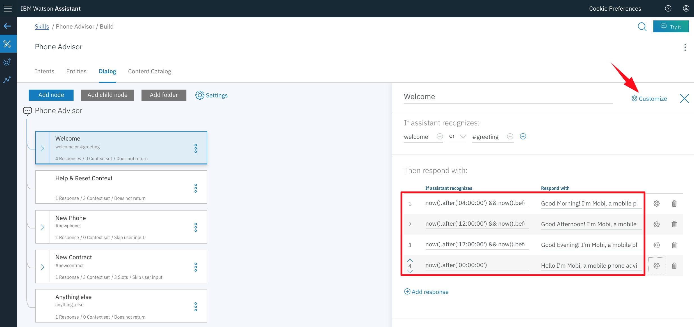

When you've done this, you should find that the initial message from your chatbot will change depending on the time of day:

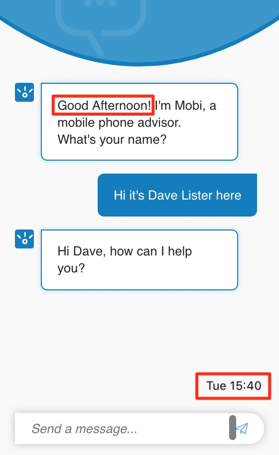

## Summary
You've reached the end of the _**Watson Assistant 101**_ labs! Over the course of five tutorials, you've learned how to:
- build chatbots in _**Watson Assistant**_ using _intents_, _entities_ and _dialogs_
- test your chatbot from within _**Watson Assistant**_
- use _rich content_ in your chatbot
- implement a publicly available, web-hosted version of your chatbot
- build _dialogs_ that collect multiple pieces of information for a user using _slots_
- work with _context_ and _expressions_ in order to add more intelligence to your responses

If you want to download the complete _**Watson Assistant**_ _skill_ we've built, you can do so [here](./assistant/skill-Phone-Advisor-lab-5.json).
